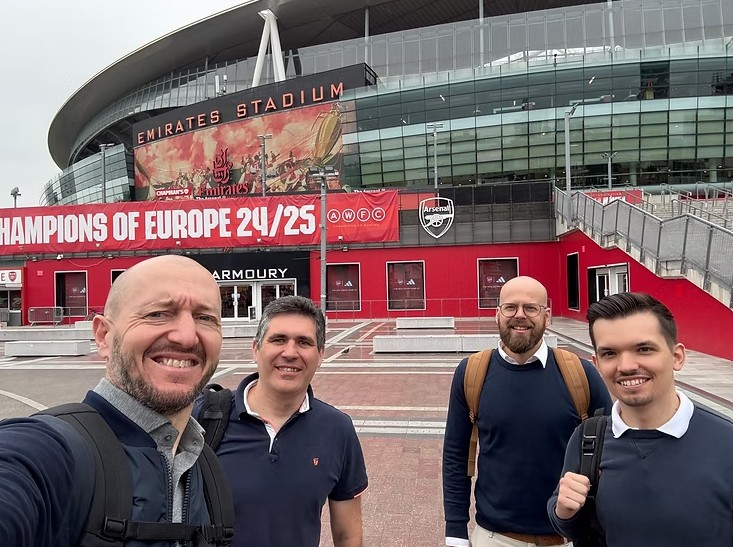
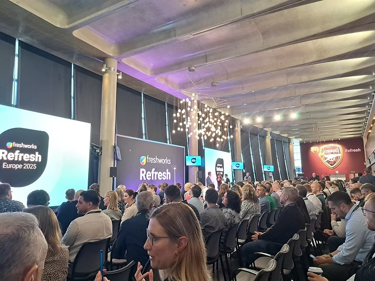

# Freshworks Refresh Europe 2025

Afgelopen woensdag 11 juni hadden we het genoegen om live deel te nemen aan het Refresh 2025-event van Freshworks. In het indrukwekkende Emirates Stadium werden we verwelkomd en ondergedompeld in de nieuwste ontwikkelingen, ambities en toekomstvisie van Freshworks.

## Freddy evolueert naar Agentic AI

Eén van de meest opvallende innovaties binnen het service management-landschap was zonder twijfel de evolutie van Freddy, de AI-companion van Freshworks. Freddy heeft dit jaar enkele belangrijke upgrades gekregen en werd tijdens het event voorgesteld als de Agentic AI. Waar Freddy voorheen fungeerde als een slim Q&A-systeem, evolueert hij nu naar een autonoom werkend ecosysteem dat niet alleen vragen beantwoordt, maar ook actief taken uitvoert. Denk bijvoorbeeld aan het verwerken van claims, bijwerken van payroll of boeken van verzendingen — allemaal volledig zelfstandig.

Dankzij deze capaciteiten als agent kan Freddy beslissingen nemen, acties uitvoeren, root causes analyseren en zelfs vervolgstappen voorstellen. Hij ondersteunt zowel klanten als servicemedewerkers, niet enkel door vragen te beantwoorden, maar ook door acties af te ronden over meerdere applicaties heen. Deze mogelijkheden kunnen toegepast worden op zeer uiteenlopende use cases zoals order tracking, accountwijzigingen, boekingen, betalingen, enzovoort.

## Freddy AI Agent Studio: no-code AI-automatisering

Een belangrijke vernieuwing die deze technologie toegankelijk maakt, is de introductie van de Freddy AI Agent Studio. Dit is een no-code platform waarmee AI-agents eenvoudig gebouwd, getest en uitgerold kunnen worden — zonder dat hiervoor technische kennis vereist is. Via een visuele interface kunnen agents unieke vaardigheden aangeleerd krijgen, zodat ze autonoom acties kunnen uitvoeren, zoals het controleren van een orderstatus of het aanmaken van een retour.

## Vooruitblik: sterke evoluties in AI-architectuur op komst

Wat tijdens Refresh 2025 duidelijk werd, is dat we ons slechts aan het begin bevinden van een veel grotere transformatie. De komende maanden worden aanzienlijke evoluties verwacht binnen de architectuur rond AI. De focus verschuift van statische modellen naar dynamische, contextbewuste systemen die in real-time kunnen leren, zich aanpassen en samenwerken met andere agents binnen een bredere digitale infrastructuur.

We zien een duidelijke trend richting:

- **Multi-agent systemen** die onderling communiceren en samenwerken om complexe workflows autonoom af te handelen.
- **Contextuele AI**, waarbij agents niet alleen reageren op input, maar ook anticiperen op behoeften op basis van historische data, gedragsanalyse en externe signalen.
- **Federated en edge AI-architecturen**, die zorgen voor snellere verwerking, betere privacy en schaalbaarheid over verschillende platformen en apparaten heen.
- **AI-governance en ethiek by design**, waarbij transparantie, controleerbaarheid en verantwoord gebruik van AI centraal staan in de architectuur.

Deze ontwikkelingen zullen niet alleen de manier waarop bedrijven AI inzetten fundamenteel veranderen. De komende maanden beloven een stroomversnelling van innovaties die AI van een ondersteunende technologie naar een strategische kerncomponent van moderne organisaties zullen transformeren.

---

*Wil je meer weten? [Contacteer ons](https://9yards.be/#contact).*

<!--
seo_title: Freshworks Refresh Europe 2025 — 9Yards
seo_description: 9Yards was aanwezig op Refresh 2025 in het Emirates Stadium. Ontdek onze takeaways over Freddy Agentic AI en de toekomst van AI-architectuur.
seo_keywords: Freshworks Refresh 2025, Freddy Agentic AI, AI Agent Studio, service management, 9Yards, AI-architectuur
-->
